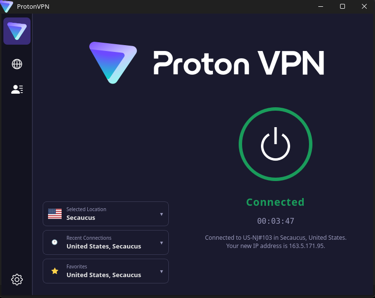
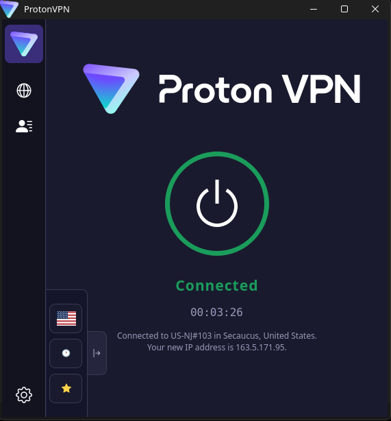
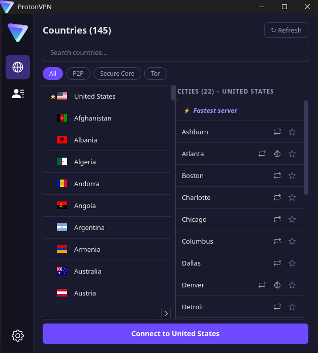
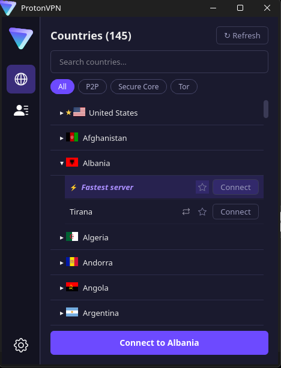
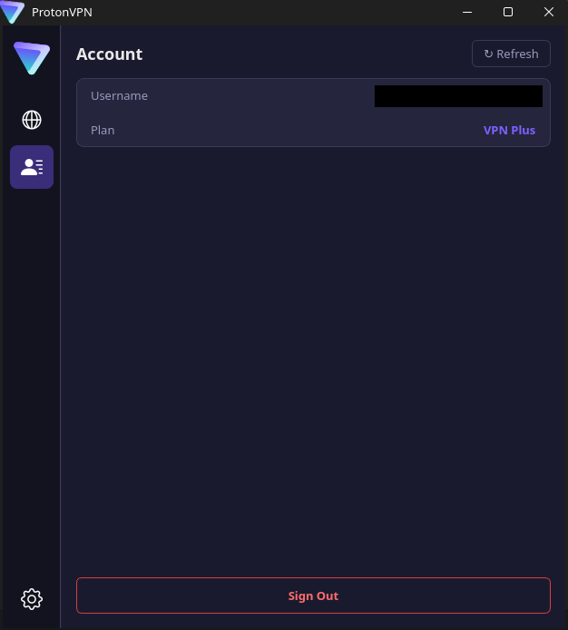
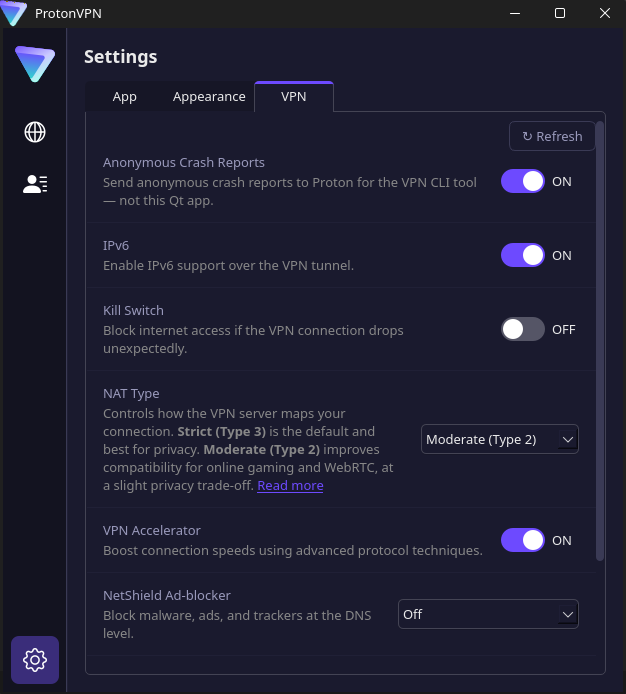
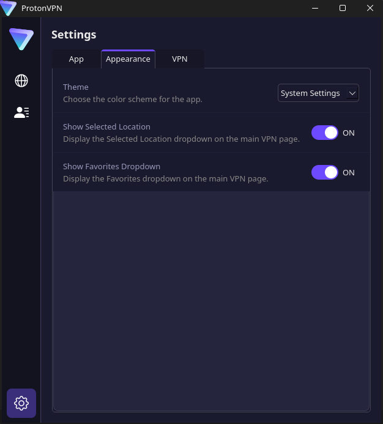
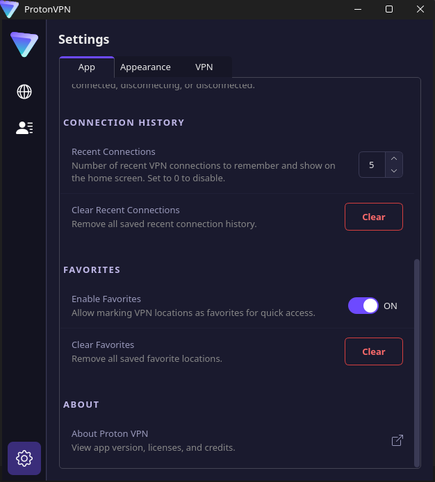
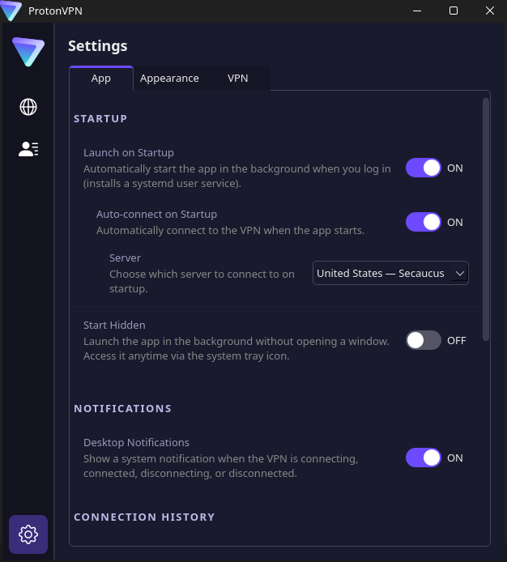

# Proton VPN GUI

A friendly Linux desktop app for [Proton VPN](https://protonvpn.com).

You sign in once, pick a country, hit the big button, and you're online through a
Proton VPN server. No terminal, no command-line flags, no fiddling with config
files. The app handles signing in, picking a fast server, reconnecting when the
link drops, and remembering your favorites so the next time is one click.

> Heads up: this project is made by the community. Proton AG made Proton VPN,
> the brand, and the CLI. We are not Proton AG. Proton and ProtonVPN are
> trademarks of Proton AG.

## What you get

- A clear main screen with a big Connect button and the country you're in.
- A searchable list of every Proton VPN country, with flags and feature tags
  like P2P, Tor, and Secure Core.
- A small map view that animates while you connect and again on disconnect.
- Favorites and a recent-connections list so returning to the same place takes
  one click.
- The same controls in a tray icon: connect or disconnect from the menu bar.
- Adjustable appearance that respects your system's light or dark theme, with
  a reduced-motion setting for calmer animations.
- Toggles for Proton-supported features that the CLI exposes, including kill
  switch, IPv6, NAT type, VPN accelerator, NetShield, and port forwarding.
- Desktop notifications when you connect or disconnect.
- Auto-launch on login, with an optional auto-connect to your last server.

## Screenshots

Main window at normal and narrow sizes:

<table>
  <tr>
    <td></td>
    <td></td>
  </tr>
</table>

Countries list, account page, and the settings tabs:

<table>
  <tr>
    <td></td>
    <td></td>
  </tr>
  <tr>
    <td></td>
    <td></td>
  </tr>
  <tr>
    <td></td>
    <td></td>
  </tr>
  <tr>
    <td></td>
    <td></td>
  </tr>
</table>

## Quick install

Pick the one that matches your Linux setup.

### Flatpak, recommended for Fedora, Linux Mint, openSUSE, and most desktop users

```bash
flatpak install flathub io.github._360900.ProtonVpnGui
flatpak run io.github._360900.ProtonVpnGui
```

Once Flathub accepts this app you install it the same way. Right now you can
build the Flatpak yourself from this repository with the included script.

### Arch Linux and Manjaro

```bash
git clone https://aur.archlinux.org/proton-vpn-gui.git
cd proton-vpn-gui
makepkg -si
```

A `proton-vpn-gui` launcher appears in your application menu.

### Native build, for Debian, Ubuntu, and other distributions

You will need the Proton VPN CLI and a handful of build tools.

```bash
sudo apt install cmake ninja-build qt6-base-dev qt6-declarative-dev \
  qt6-svg-dev qt6-tools-dev libqt6dbus6
git clone https://github.com/360900/proton-vpn-gui.git
cd proton-vpn-gui/src
cmake -B build -G Ninja -DCMAKE_BUILD_TYPE=Release
cmake --build build
./build/proton_vpn_gui
```

The build produces a single `proton_vpn_gui` binary that you can run directly.

## Before you start

This app is a friendly face for the **Proton VPN Linux CLI**. The CLI does the
real work: signing in, opening the tunnel, switching servers, and applying your
settings. You need to install it once before the GUI can do anything, even on
Flatpak. The Flatpak version calls the CLI on your host through Flatpak's
bridge, so the CLI still has to be on your host system, not inside the Flatpak.

If you don't have it yet, follow Proton's official Linux guide:
[protonvpn.com/support/linux-vpn-tool](https://protonvpn.com/support/linux-vpn-tool/).

> Warning: the official Proton VPN GTK app and this app cannot run at the same
> time. They both talk to the same CLI and will trip over each other. Pick
> this one and uninstall the GTK app.

## Day-to-day tips

- First launch walks you through signing in. After that, opening the app takes
  you straight to the main screen.
- The globe animates while a connection is being established and again when you
  disconnect, so you can tell at a glance what's happening even if you have
  the window minimized.
- Right-click the tray icon for quick connect, disconnect, or quit options.
- Free tier users can still connect, but Proton picks the server for you and
  the country picker is hidden. To pick a country yourself you need a paid
  Plus plan.
- Connecting to a server that supports port forwarding enables automatic
  port-forward management. You need the optional `libnatpmp` package
  (Debian, Ubuntu, Fedora, Arch) and a Plus plan.

## Common questions

**Does this app collect my data?**
No. The app delegates everything to the Proton VPN CLI on your machine and
exposes a session D-Bus interface for status and basic control. There is no
extra telemetry from this GUI.

**Will my settings and servers carry over?**
Yes. Your favorites, recent connections, and preferences live under
`~/.config/ProtonVPN-GUI/` (or the equivalent Flatpak config path) and stay
between upgrades.

**Why does it ask for a 2FA code?**
That's Proton asking, not us. Proton sometimes needs a second factor on sign
in. The app passes it through to the CLI for you.

**The connection failed with a confusing message. What now?**
Try the same action from the Proton VPN CLI directly. The error message will
usually be the same one. If that works, the GUI will work on the next attempt.

**Can other tools talk to this app?**
Yes. It publishes a session-bus interface at
`io.github._360900.ProtonVpnGui` with status and basic connect, disconnect,
and raise-window methods. Scripts and other apps can use it to react to the
VPN state.

## For developers

The code is split into a small C++ core and a Qt Quick interface. The core
wraps the CLI, parses its output, runs status polling, and tracks connection
state with a small state machine. The QML side reads the core and renders the
UI.

```bash
cmake -S src -B build -G Ninja -DCMAKE_BUILD_TYPE=Debug
cmake --build build
cd build
ctest --output-on-failure
```

Twelve unit tests cover the parsers, state machine, process runner, status
poller, service, configurations, and history. Three more integration tests
cover Flatpak, UI helpers, and IPv6 utilities.

## License

This project is licensed under the GNU General Public License, version 3. See
[LICENSE](LICENSE).
